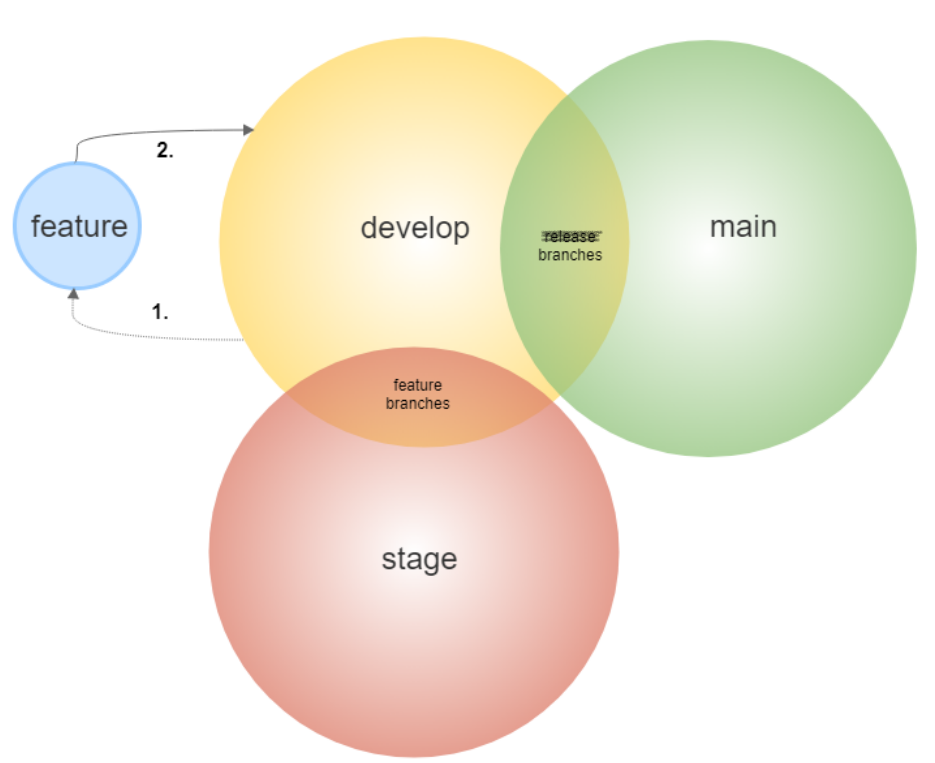

# Branching

Long-lived branches:

* `main`
  - runs the production environment
* `develop`
  - runs development environments

Short-lived branches (denoted as feature branches or `feat/*`):

* `major/*`
  - should contain commits incrementing **1**.10.5 -> **2**.0.0
* `feat/*`
  - should contain commits incrementing 1.**10**.5 -> 1.**11**.0
* `perf/*`
  - should contain commits incrementing 1.10.**5** -> 1.10.**6**
* `fix/*`
  - should contain commits incrementing 1.10.**5** -> 1.10.**6**
* `docs/*`
  - commits do not increment semantic versions

* other branch names will be prevented from merging into *long-lived* branches 

## Pull requests

"Merges" is used as a term that applies to pull request merges **only**.

1. `main <- develop` merges do not increment semantic versions
2. `develop <- feat/*` merges increment semantic versions
   - if a build fails on a "push" event (triggering application build), the `feat/*` branch will be blocked from merging
   - if a commit messages do not meet [commitlint conditions](https://github.com/conventional-changelog/commitlint/tree/master/%40commitlint/config-conventional) on a "pull request opened" event, the `feat/*` branch will be blocked from merging
